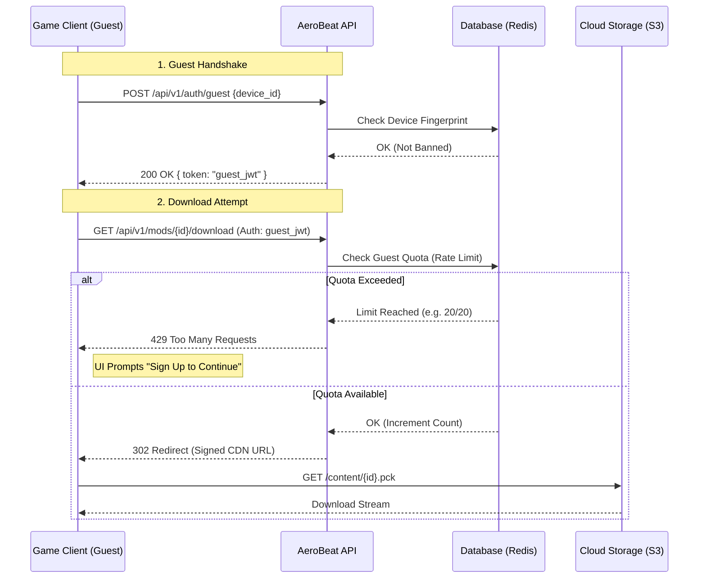

# Backend API Specification

This document defines the REST API endpoints used by the **Modding SDK** (for creators) and the **Game Client** (for athletes).

## 🛡️ Security & Mitigation Strategy

To protect the platform from abuse, we implement strict security measures for all User Generated Content (UGC).

| Risk | Mitigation Strategy |
| :--- | :--- |
| **DDoS / Bandwidth Exhaustion** | **Pre-Signed URLs.** Uploads go directly to Cloud Storage (S3), bypassing API servers. |
| **Storage Exhaustion** | **User Quotas.** Strict limits per user (e.g., 2GB total). |
| **Zip Bombs** | **Stream Inspection.** Validators check uncompressed size before extraction. |
| **RCE (Remote Code Execution)** | **Sandboxing.** Validation runs in ephemeral, network-isolated containers. |
| **Scraping / Leeching** | **Guest Rate Limits.** Unverified users have strict download caps (e.g., 20 items/day). |

## 📦 Data Integrity & Versioning

To prevent **Dependency Rot** (where a Playlist breaks because a referenced Song or Skin was deleted or changed), the API enforces strict immutability rules.

### 1. Immutable Versioning
*   **Policy:** Once an asset (Skin, Song, Environment) is published, its binary content (`.pck`) is **Immutable**. It can never be overwritten.
*   **Updates:** When a creator updates a mod, the API generates a new version (e.g., `v2`).
*   **References:** Playlists and other dependent assets reference specific versions (e.g., `mod_id@v1`). This ensures that even if `v2` changes the art style completely, the original playlist using `v1` remains visually consistent.

### 2. Soft Delete Policy
*   **Risk:** If a creator deletes a popular Song, every Playlist using that song would break.
*   **Policy:** The API does not support "Hard Deletes" for public content.
*   **Action:** When a creator "deletes" a mod:
    1.  **Unlisted:** It is removed from Search and the "New Releases" feed.
    2.  **Archived:** It remains on the CDN.
    3.  **Available:** Existing playlists referencing the ID can still download and play it.
*   **Exception:** DMCA Takedowns or Illegal Content result in a "Hard Delete" (or replacement with a placeholder), which *will* break dependencies. This is unavoidable for legal compliance.

## 🔐 Authentication & Guest Access

We support two tiers of access to balance friction vs. security.

1.  **Verified Athlete:** Signed in. Full access (Upload, Rate, Sync). High rate limits.
2.  **Guest Athlete:** No account. Read-only access. Strict rate limits.

*   **Header:** `Authorization: Bearer <token>` (Required for **ALL** requests, including Guests).

### Guest Handshake
To access the API as a guest, the client must first request a temporary session.

*   **Endpoint:** `POST /api/v1/auth/guest`
*   **Body:** `{"device_id": "uuid"}` (Used for fingerprinting abuse).
*   **Response:** Returns a short-lived JWT (e.g., 24 hours) with `scope: guest`.

## 📤 Creator Endpoints (Modding SDK)

These endpoints are used by the specialized SDKs (`aerobeat-skins-*`, `aerobeat-avatars-*`, etc.) to publish content.

### 1. Check Quota

*   **Endpoint:** `GET /api/v1/user/quota`
*   **Response:**
    *   `used_bytes`: Total bytes used by this user.
    *   `limit_bytes`: Maximum allowed storage.
    *   `remaining_bytes`: Available space.

### 2. Request Upload (Pre-Signed URL)

*   **Endpoint:** `POST /api/v1/mods/upload-request`
*   **Body:**
    *   `filename`: "my_skin.pck"
    *   `size_bytes`: 10485760
    *   `checksum`: SHA256 hash of the file.
    *   `type`: `SKIN` (or `SONG`, `COACHING`, `PLAYLIST`, `AVATAR`, `COSMETIC`, `ENVIRONMENT`)
*   **Response:**
    *   `upload_url`: The S3 Pre-Signed URL (PUT).
    *   `upload_id`: Temporary transaction ID.
    *   `expires_in`: Seconds until URL expires (e.g., 900).
*   **Errors:**
    *   `403 Forbidden`: User not verified.
    *   `413 Payload Too Large`: File exceeds type limit (e.g., Skin > 50MB).
    *   `429 Too Many Requests`: Rate limit exceeded.
    *   `507 Insufficient Storage`: User quota exceeded.

### 3. Complete Upload

*   **Endpoint:** `POST /api/v1/mods/upload-complete`
*   **Body:**
    *   `upload_id`: The ID from step 2.
    *   `manifest`: JSON representation of `AeroModManifest` (for indexing).
*   **Response:**
    *   `202 Accepted`: Validation job queued.
    *   `mod_id`: The permanent ID of the new mod.

### 4. Check Validation Status

*   **Endpoint:** `GET /api/v1/mods/{mod_id}/status`
*   **Response:**
    *   `status`: `PENDING`, `VALIDATING`, `APPROVED`, `REJECTED`.
    *   `errors`: List of validation errors (e.g., "Script detected in resource X").

### 5. Search Assets (SDK Browser)

*   **Endpoint:** `GET /api/v1/assets/search`
*   **Query Params:**
    *   `q`: Search query string (Title, Artist, Tag).
    *   `type`: `SONG`, `PLAYLIST` (Filter by asset type).
    *   `page`: Pagination cursor.
*   **Response:** JSON list of Asset Summaries (ID, Title, Author, Metadata).

## 📥 Athlete Endpoints (In-Game Browser)

These endpoints are used by the Game Client (`aerobeat-assembly-*`) to discover and download content.

### 1. Browse Content

*   **Endpoint:** `GET /api/v1/mods`
*   **Query Params:**
    *   `type`: `SKIN`, `SONG`, `ENVIRONMENT`, `COACHING`, `PLAYLIST`, `AVATAR`, `COSMETIC`
    *   `feature`: `boxing`, `flow` (Filter by gameplay mode)
    *   `sort`: `popular`, `newest`, `rating`
    *   `page`: Pagination cursor.
*   **Response:** JSON list of Mod Summaries (Thumbnail URL, Title, Author).

### 2. Download Mod

*   **Endpoint:** `GET /api/v1/mods/{mod_id}/download`
*   **Response:**
    *   `429 Too Many Requests`: Guest quota exceeded (Prompt user to Sign Up).
    *   `302 Redirect`: Redirects to CDN URL (S3/CloudFront) for the `.pck` file.
    *   **Headers:** `Content-Disposition: attachment; filename="mod_id_v1.pck"`

### 3. Sync Library

*   **Endpoint:** `GET /api/v1/user/library`
*   **Purpose:** Returns a list of all mods the user has "subscribed" to, allowing the game to auto-download them on a new device.

## 💳 Billing & Supporter Endpoints

These endpoints handle the "Supporter" status transactions. We use a Merchant of Record (e.g., Stripe) to handle actual credit card processing.

### 1. Create Checkout Session

*   **Endpoint:** `POST /api/v1/billing/checkout`
*   **Auth:** Verified User Only.
*   **Body:**
    *   `tier_id`: Enum (`1_month`, `1_year`, etc.) matching the pricing plan.
*   **Response:**
    *   `checkout_url`: The URL to redirect the user's browser to (Stripe Hosted Page).
    *   `session_id`: The transaction ID.

### 2. Webhook Handler (Server-to-Server)

*   **Endpoint:** `POST /api/v1/billing/webhook`
*   **Auth:** Webhook Signature Verification (Stripe-Signature header).
*   **Purpose:** Receives asynchronous payment confirmation from the provider.
*   **Action:**
    *   Verifies signature.
    *   Finds user associated with the session.
    *   Updates `supporter_expiry` timestamp in the database (handling stacking logic).

### 3. Get Supporter Status

*   **Endpoint:** `GET /api/v1/user/status`
*   **Auth:** Verified User.
*   **Response:**
    *   `is_supporter`: Boolean.
    *   `supporter_expiry`: ISO 8601 Timestamp (or null).
    *   `active_perks`: List of strings (e.g., `["crew_creation", "extended_history"]`).

## 📊 Sequence Diagrams

### Guest Download Flow



## 🛠️ Client Implementation

The Game Client interacts with these endpoints via the **`aerobeat-tool-api`** service. This tool handles:

*   **Authentication:** Automatically injects the Bearer Token into headers.
*   **Resilience:** Implements exponential backoff for failed requests (429/5xx).
*   **Type Safety:** Parses JSON responses into strict GDScript Dictionary or Resource objects.
```