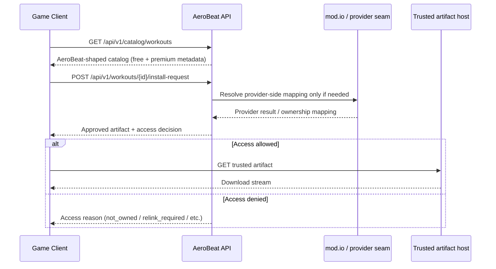
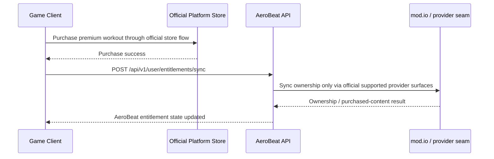

# Backend API Specification

This document defines the high-level AeroBeat-owned REST API surfaces used by both the **game client** (for athletes) and the **creator-side tooling**.

These are **AeroBeat-owned API surfaces**. Even with **mod.io as the current outer community/distribution shell** for free and premium workout distribution, the client/runtime trust contract stays first-party: AeroBeat keeps athlete identity, package IDs, validation, bake/signing authority, entitlement vocabulary, quarantine/revocation state, and final install/mount policy.

This document is intentionally **AeroBeat-shaped**, not a provider pass-through contract.

## Strategic framing

The API should now be read through the current product strategy:

- **AeroBeat is free-to-play**
- the catalog includes **free workouts** and **premium workouts**
- premium purchases must flow through **official platform/store paths**
- mod.io may serve as the current premium UGC/community/distribution layer and purchased-content server **after official platform-originated sync where legitimately supported**
- `aerobeat-tool-api` is the client-facing identity/access/entitlement manager, not a raw mod.io wrapper

## 🛡️ Security & mitigation strategy

To protect the platform from abuse, AeroBeat should implement strict security measures for all UGC and workout distribution flows.

| Risk | Mitigation Strategy |
| :--- | :--- |
| **DDoS / bandwidth exhaustion** | **Brokered direct uploads.** Uploads go directly to an authorized storage/provider target, bypassing API servers. |
| **Storage exhaustion** | **User quotas.** Strict limits per creator/user. |
| **Zip bombs** | **Stream inspection.** Validators check uncompressed size before extraction. |
| **RCE (Remote Code Execution)** | **Sandboxing.** Validation runs in ephemeral, network-isolated containers. |
| **Scraping / leeching** | **Guest and low-trust rate limits.** Unverified users have strict browse/download caps. |
| **Entitlement abuse** | **Platform-linked purchase verification and reconciliation.** Premium access is derived from official purchase paths plus provider/first-party sync where supported. |

## 📦 Data integrity, trust, and versioning

To prevent dependency rot, broken libraries, or trust confusion, the API should enforce strict versioning and runtime-trust rules.

### 1. Immutable versioning

- once an asset or workout version is published, its binary content is **immutable**
- updates create a new version rather than overwriting the old one
- dependent content references exact versions where necessary

### 2. Soft-delete policy

Public content should prefer unlist/archive behavior over hard deletion, except where legal or security policy requires stronger action.

### 3. First-party runtime trust

A provider listing being available is not the same thing as the content being runtime-trusted.

AeroBeat-owned systems should track:

- canonical content ID/version
- approval state
- compatibility state
- quarantine/revocation state
- allowed install/download target
- access class (`free`, `premium`, or future variants)

## 🔐 Authentication and actor model

AeroBeat should support at least these actor classes:

1. **Guest athlete** — read-only or limited-access user without a durable AeroBeat account session
2. **Signed-in athlete** — AeroBeat account holder with linked identity and library/progression state
3. **Creator** — signed-in account permitted to publish/manage community content

### Authentication principles

- `Authorization: Bearer <token>` remains the default transport
- tokens represent **AeroBeat session truth**, even if upstream identity/provider linkage participates underneath
- provider-specific account-linking mechanics should remain inside the vendor seam

### Guest handshake

**Endpoint:** `POST /api/v1/auth/guest`

**Purpose:** request a temporary guest session for limited browse/download access.

**Body:**

- `device_id`: device fingerprint or equivalent abuse-control identifier

**Response:**

- short-lived token
- actor scope such as `guest`
- optional access-policy summary for client UX

### Linked-account status

**Endpoint:** `GET /api/v1/account/links`

**Purpose:** return the athlete's linked account/provider/platform status in AeroBeat terms.

**Response example fields:**

- `athlete_id`
- `has_aerobeat_account`
- `linked_platforms`
- `linked_provider_accounts`
- `requires_relink` flags when relevant

This endpoint should not expose raw provider-link flow details as the long-term public contract.

## 👤 Athlete-facing endpoints

These endpoints serve the free-to-play game client and should be consumed through `aerobeat-tool-api`.

### 1. Browse content

**Endpoint:** `GET /api/v1/catalog/workouts`

**Purpose:** browse AeroBeat-approved workouts with enough metadata for in-game discovery.

**Query params may include:**

- `access`: `free`, `premium`, `all`
- `feature`: `boxing`, `flow`
- `sort`: `popular`, `newest`, `rating`, `recommended`
- `page`

**Response should remain AeroBeat-shaped**, for example:

- `workout_id`
- `title`
- `author`
- `access_class`
- `is_owned`
- `trust_state`
- `thumbnail_url`

### 2. Get workout detail

**Endpoint:** `GET /api/v1/catalog/workouts/{workout_id}`

**Purpose:** fetch trusted detail for one workout including access and compatibility status.

**Response may include:**

- content metadata
- exact version / approved artifact summary
- `access_class`
- `ownership_state`
- compatibility flags
- revocation/quarantine warnings when relevant

### 3. Sync library

**Endpoint:** `GET /api/v1/user/library`

**Purpose:** return the athlete's current library in AeroBeat terms.

This should unify the client view of:

- free acquired/subscribed workouts
- premium owned workouts
- installable versions
- hidden/revoked entries where policy requires disclosure

### 4. Get entitlement/access summary

**Endpoint:** `GET /api/v1/user/entitlements`

**Purpose:** return an AeroBeat-facing summary of workout/content access.

**Response may include:**

- owned premium workout IDs
- free access grants
- pending reconciliation states
- linked-account requirements

This endpoint is intentionally safer than making client contracts depend on raw provider wallet or purchase-record semantics.

### 5. Resolve install/download

**Endpoint:** `POST /api/v1/workouts/{workout_id}/install-request`

**Purpose:** resolve whether the athlete may install a trusted workout version and where to fetch it.

**Response may include:**

- approved artifact/version
- checksum/signature metadata
- authorized download target
- access denial reason if blocked (`not_owned`, `not_approved`, `relink_required`, `guest_restricted`, etc.)

### 6. Favorites / subscriptions / recommendations

These may remain separate endpoints or be folded into library/profile APIs, but they should still speak in AeroBeat product terms rather than provider-native vocabulary.

## 🧰 Creator-facing endpoints

These endpoints are used by creator tooling and SDKs to publish content through AeroBeat-controlled trust flows.

### 1. Check quota

**Endpoint:** `GET /api/v1/user/quota`

### 2. Request upload

**Endpoint:** `POST /api/v1/submissions/upload-request`

**Body may include:**

- filename
- size/checksum
- content type (`SONG`, `WORKOUT`, `COACHING`, `ENVIRONMENT`, etc.)
- target feature (`boxing`, `flow`)

**Response may include:**

- authorized upload target
- upload transaction/submission ID
- expiry

The upload target may be first-party storage or a provider-brokered target. That transport detail stays behind the AeroBeat contract.

### 3. Complete upload

**Endpoint:** `POST /api/v1/submissions/upload-complete`

**Purpose:** confirm upload success and attach the manifest/metadata needed for validation.

### 4. Check submission status

**Endpoint:** `GET /api/v1/submissions/{submission_id}`

**Response should use AeroBeat statuses**, such as:

- `PENDING`
- `VALIDATING`
- `APPROVED`
- `REJECTED`
- `QUARANTINED`
- `PUBLISHED`

### 5. Creator catalog / owned listings

**Endpoint example:** `GET /api/v1/creator/content`

**Purpose:** return the creator's content in AeroBeat terms, even if the outer listing/distribution surface is currently mod.io.

## 💳 Premium workout purchase and ownership flows

AeroBeat should frame premium access around **platform-compliant purchases** plus **AeroBeat-shaped entitlement results**.

### 1. Start purchase handoff

**Endpoint:** `POST /api/v1/premium/workouts/{workout_id}/purchase-intent`

**Purpose:** return the appropriate official platform/store handoff for purchasing this premium workout.

**Response may include:**

- platform/store route information
- SKU/product identifier
- client instructions for the current platform

This endpoint should not imply AeroBeat is the merchant of record when platform rules require otherwise.

### 2. Sync ownership after purchase

**Endpoint:** `POST /api/v1/user/entitlements/sync`

**Purpose:** reconcile official purchase state into AeroBeat-visible entitlement state.

Depending on platform/provider capabilities, this may involve:

- platform-authenticated verification
- provider-side sync through official supported surfaces
- first-party entitlement refresh

The client should see only the resulting AeroBeat access state.

### 3. Check ownership status

**Endpoint:** `GET /api/v1/user/entitlements/{workout_id}`

**Purpose:** return whether the athlete currently has access to that premium workout and whether any action is required.

**Possible states:**

- `owned`
- `not_owned`
- `sync_required`
- `relink_required`
- `temporarily_unavailable`

## 📊 Sequence diagrams

### Guest / signed-in browse and install flow

```mermaid
sequenceDiagram
    participant Client as Game Client
    participant API as AeroBeat API
    participant Provider as mod.io / provider seam
    participant CDN as Trusted artifact host

    Client->>API: GET /api/v1/catalog/workouts
    API-->>Client: AeroBeat-shaped catalog (free + premium metadata)

    Client->>API: POST /api/v1/workouts/{id}/install-request
    API->>Provider: Resolve provider-side mapping only if needed
    Provider-->>API: Provider result / ownership mapping
    API-->>Client: Approved artifact + access decision

    alt Access allowed
        Client->>CDN: GET trusted artifact
        CDN-->>Client: Download stream
    else Access denied
        API-->>Client: Access reason (not_owned / relink_required / etc.)
    end
```

### Premium purchase reconciliation flow

```mermaid
sequenceDiagram
    participant Client as Game Client
    participant Store as Official Platform Store
    participant API as AeroBeat API
    participant Provider as mod.io / provider seam

    Client->>Store: Purchase premium workout through official store flow
    Store-->>Client: Purchase success
    Client->>API: POST /api/v1/user/entitlements/sync
    API->>Provider: Sync ownership only via official supported provider surfaces
    Provider-->>API: Ownership / purchased-content result
    API-->>Client: AeroBeat entitlement state updated
```

## 🛠️ Client implementation

The game client should consume these capabilities via **`aerobeat-tool-api`**.

That tool is the AeroBeat-facing singleton/API-manager lane for:

- athlete identity and linked-account status
- discovery and library sync
- free vs premium workout access checks
- trusted install/download policy
- creator submission/status flows

Product repos should consume `aerobeat-tool-api` instead of talking to mod.io or other provider APIs directly. See [UGC API Manager Topology](ugc-api-manager-topology.md) and [Account, Identity, and Entitlements Strategy](account-identity-and-entitlements.md).
